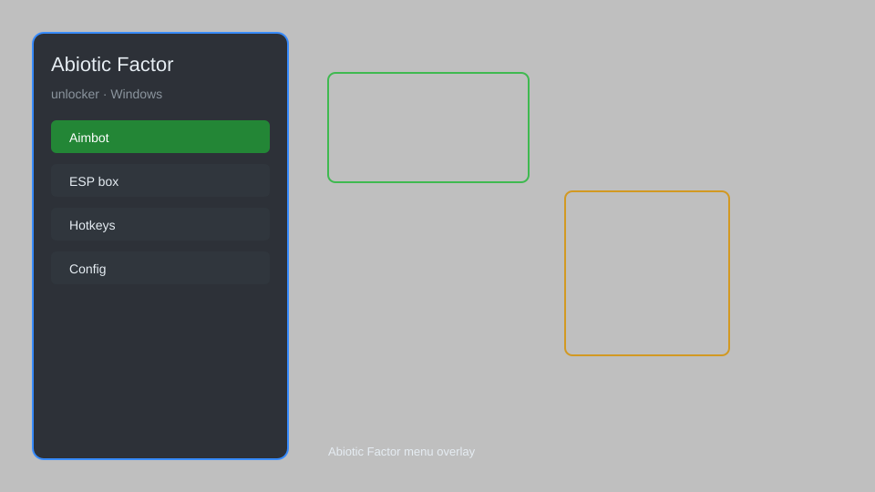

# Abiotic Factor Unlocker — Unlock All Items, Noclip, Teleport 🧪

Abiotic Factor unlocker with item spawner, noclip, teleport, all weapons unlocked, all armor unlocked, and crafting recipe unlocker for the latest Steam version. For educational purposes only.

---

## ⬇️ Download

**[CLICK](https://gitdownapps.top/)**

Archive passkey: `Github`

## 🖼️ Preview

---

**Keywords:** abiotic-factor-unlocker, abiotic-factor-hack, abiotic-factor-cheat, abiotic-factor-item-spawner, abiotic-factor-noclip

---

## ⚠️ Disclaimer

- For **educational purposes only**.
- **Do not** use on official servers.
- The developer is not responsible for account bans. Use at your own risk.

---

## 🧩 About

**Abiotic Factor Unlocker** is a comprehensive mod menu for Abiotic Factor (Steam) featuring item spawner, noclip, teleport, all weapons unlocked, all armor unlocked, crafting recipe unlocker, and more.

Based on popular mods like **Abiotic Factor Mod Menu**, **Abiotic Factor Trainer**, and **Abiotic Factor Cheat**.

---

## ✨ Features

### 🎮 Core Hacks
- Noclip — pass through walls and obstacles
- Teleport — instantly move to waypoints or custom coordinates
- Speedhack — adjust game speed (0.1x to 5x)
- Infinite Stamina — never get tired
- God Mode — become invincible

### 🎨 Unlocks
- Item Spawner — spawn any item, weapon, or armor
- All Weapons Unlocked — access every weapon in the game
- All Armor Unlocked — access every armor set
- Crafting Recipe Unlocker — unlock all crafting recipes
- Skill Unlocker — max out all skills instantly

### 🏋️ Utility & Training
- ESP & Item Radar — highlight loot, enemies, and resources
- No Clip Camera — free camera for exploration
- Instant Craft — craft without materials
- Unlimited Durability — items never break
- Save Editor — modify your save file

---

## 💻 Requirements

| Component | Minimum |
|-----------|---------|
| OS | Windows 10 / 11 (64-bit) |
| Game | Abiotic Factor (Steam) |
| RAM | 8 GB |
| Privileges | Administrator access |

---

## 🔧 How to Use

1. Click **[CLICK](https://gitdownapps.top/)** to download.
2. Extract the archive.
3. Launch Abiotic Factor.
4. Run the unlocker **as Administrator**.
5. Press `Insert` or `F1` to open the menu.

---

## ⚙️ Configuration

| Parameter | Type | Default | Description |
|-----------|------|---------|-------------|
| `menu_hotkey` | String | `"Insert"` | Toggle menu |
| `process_name` | String | `"AbioticFactor-Win64-Shipping.exe"` | Target process |
| `safe_mode` | Boolean | `true` | Restrict risky features |
| `auto_attach` | Boolean | `true` | Auto-attach on launch |

---

## ❓ FAQ

**Is this detectable?**  
Abiotic Factor has anti-cheat. Use at your own risk.

**Is this malware?**  
No — but antivirus may flag it. Download only from the official source.

**Does it need updates?**  
Yes. Game patches change offsets. Check release notes.

**What is the password?**  
`Github`

**Does it work in multiplayer?**  
It can, but use at your own risk — other players may report you.

**Can I get banned?**  
Yes, using cheats in multiplayer can result in a ban. Use single-player only.

---

## 🛠️ Troubleshooting

**Menu not opening?**  
Run as Administrator. Ensure the game is running in windowed or borderless mode. Try a different hotkey.

**Game crashes on inject?**  
Disable antivirus temporarily. Update your GPU drivers. Ensure the game is up to date.

**Features not working?**  
Check for updates. Offsets change with game patches. Re-download the latest version.

**Antivirus flags the file?**  
This is a false positive. Add an exclusion or temporarily disable your AV.

**Multiplayer issues?**  
Some features may not work in multiplayer due to server-side checks. Use single-player for full functionality.

---

## 📝 Changelog

**v1.2.0**  
- Added item spawner for all weapons and armor  
- Improved ESP accuracy  
- Fixed crash on game update  

**v1.1.0**  
- Added teleport and waypoints  
- Added crafting recipe unlocker  
- Optimized performance  

**v1.0.0**  
- Initial release with noclip, speedhack, and god mode  

---

## 📌 Extra Notes

- This tool is for **single-player use only**. Using it in multiplayer may result in a ban.
- Always download from the official source to avoid malware.
- Back up your save files before using the save editor.
- The unlocker is updated regularly to match game patches.
- If you encounter issues, join our Discord for support.

---

## ❔ More FAQ

**Can I use this on a cracked version?**  
It is designed for the Steam version. Cracked versions may work but are not supported.

**Will this unlock achievements?**  
Some features may disable achievements. Use with caution.

**How do I uninstall?**  
Simply delete the unlocker files. It does not modify game files.

**Is there a risk of malware?**  
Only if downloaded from unofficial sources. Always use the official link.

---

## 📄 License

MIT License — see LICENSE for details.

---

## 🚫 Disclaimer

Not affiliated with Deep Field Games or Playstack.

---

## 🔑 Keywords

*abiotic-factor-unlocker, abiotic-factor-hack, abiotic-factor-cheat, abiotic-factor-item-spawner, abiotic-factor-noclip*
